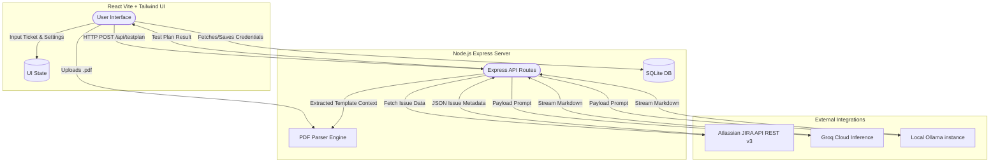

# Intelligent Test Plan Generator

An automated Quality Assurance (QA) tool leveraging Agentic AI and JIRA data to generate comprehensive test plans based on custom-provided PDF templates.

## ✨ Features
- **JIRA Integration:** Automatically fetches ticket details, descriptions, priorities, and acceptance criteria.
- **Dynamic Template Extraction:** Upload PDF templates, which parse and format the structure of the resulting Test Plan to adhere to your company's QA standards.
- **Dual LLM Support:**
  - **Local Privacy (Ollama):** Run models like `llama3.2` locally for strict security without sending data outside.
  - **Cloud Reasoning (Groq):** Sub-second generation using open-source reasoning models (e.g. `mixtral`, `llama3-70b`).
- **Secure Credentials:** Keys and secrets are securely managed and stored in an internal SQLite Database.
- **Export Ready:** Generate, preview in markdown, and export directly as `.md` files.

---

## 🏛️ Architecture & Workflow

The architecture is split into a seamless React-Vite front end and an Express-Node backend working as an intermediary to multiple LLMs and Atlassian APIs.



---

## 💻 Technology Stack
- **Frontend Layer:** React.js, TypeScript, Vite, Tailwind CSS, shadcn/ui.
- **Backend Service Layer:** Node.js, Express.js, Multer (File Handling).
- **Storage Layer:** Local File System (PDFs), SQLite (History & Environment Keys).
- **Libraries/Integrations:** Groq SDK / API, Ollama REST API, JIRA REST, `pdf-parse`.

## 🚀 Running Locally

### Prerequisites
- Node.js (v18+)
- Local instance of Ollama running (if using local models).

### 1. Backend Setup
```bash
cd backend
npm install
node server.js
```
*The backend server will run natively on `http://localhost:3001`.*

### 2. Frontend Setup
```bash
cd frontend
npm install
npm run dev
```
*The frontend user interface will be available at `http://localhost:5173`.*

## ☁️ Deployment (e.g., Render)

To make it seamlessly available for QA Teams, both applications can function harmoniously under **One Server Process**:

1. Setup **Render Web Service** natively to Node.
2. Ensure you add a **Persistent Disk** anchored to `/opt/render/project/src/storage` to prevent database and template resets.
3. Use the following commands:
   - **Build Command:** `npm install --prefix frontend && npm run build --prefix frontend && npm install --prefix backend`
   - **Start Command:** `cd backend && node server.js`

*Note: In production builds, the Express server auto-detects `frontend/dist` and servers it alongside API routes.*
